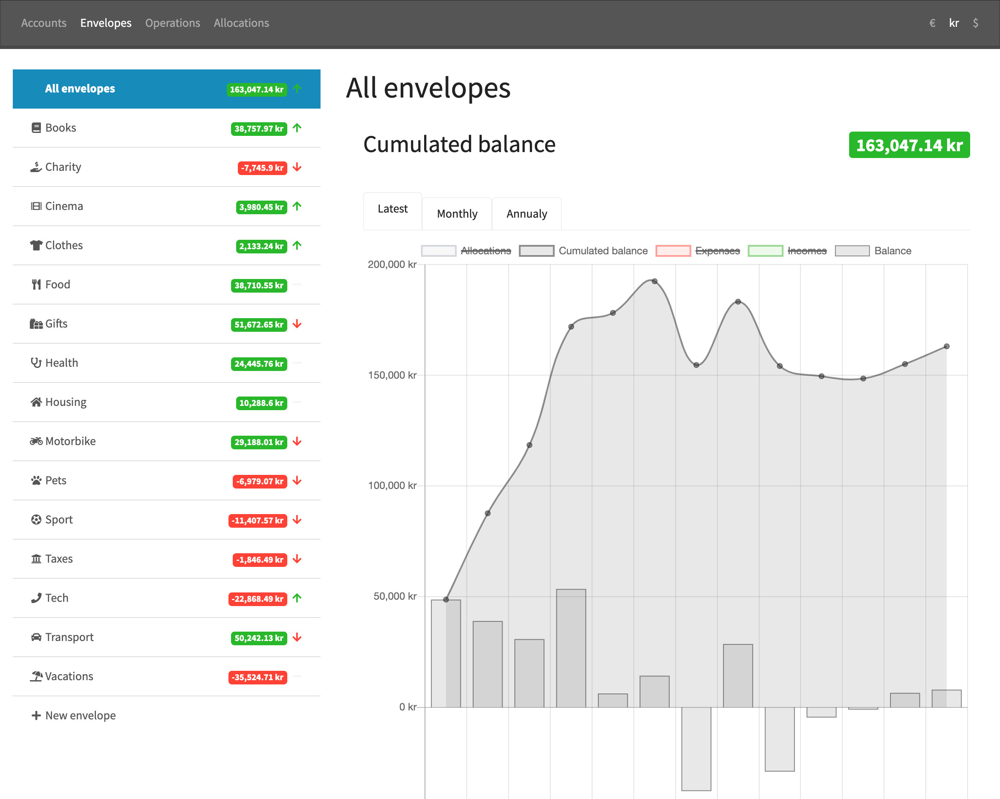

<p align="center">
    
</p>
<p align="center">
    Categorise your expenses, allocate your incomes and build up your savings with <a href=https://www.daveramsey.com/blog/envelope-system-explained>envelopes</a>.<br>
</p>
<p align="center">
    Demo available at https://budget-demo.dubandubois.com
</p>

## Status

[](https://codeclimate.com/github/simondubois/budget/maintainability)

This application is now considered as stable.
No more features are planned, but feel free to suggest some if you need.
Documentation, feature, fix, UX, logo, translation... any help is welcome !

## Features...

### ....for end users

- complete solution for a flexible [envelope system](https://www.daveramsey.com/blog/envelope-system-explained).
- monhtly allocations to set spending limits.
- optimized operation list for both searching and doing the books.
- visual comparison between bank account balance and target savings.
- immediate feedback about global and individual envelope healths.
- monthly and yearly history.
- multi currency support with immediate conversion.
- daily currency rate update.
- monthly currency rate history chart.
- responsive design.
- multi language (currently supported: English, French).

### ...for administrator

- generic REST API so any client can communicate with the backend.
- possibility to use [web cron](https://en.wikipedia.org/wiki/Webcron) if [systen cron](https://en.wikipedia.org/wiki/Cron) is not available.
- compiled frontend assets (no need to run node.js on the server).
- built on [Laravel 6](https://laravel.com/docs/6.x) and [Vuejs 2.5](https://vuejs.org/v2/guide/).

## Requirements

- a web server (tested with Apache).
- PHP >= 7.2.
- MySQL (tested with version 5.6 and 5.7).
- [composer](https://getcomposer.org/)

## Deployment

1. Download the code to an empty folder:
```bash
git clone https://github.com/simondubois/budget.git /var/www/budget
```
2. Create the configuration file:
```bash
cd /var/www/budget && cp .env.example .env
```
3. In the `.env` file, set `APP_KEY`:
```
 APP_KEY=a_random_string_with_many_symbols
 ```
4. Install the dependencies:
```bash
composer install --optimize-autoloader --no-dev
```
5. Insert one or more currency in the database ([examples](https://github.com/simondubois/budget/blob/master/database/factories/CurrencyFactory.php)):
```sql
INSERT INTO `currencies` (`iso`, `name`, `unit`) VALUES ('USD', 'United States dollar', '$');
```
6. In the `.env` file, set `BUDGET_DEFAULT_CURRENCY` to on the `iso` values you have just inserted:
```
BUDGET_DEFAULT_CURRENCY=USD
```
7. Fetch currency rates for today (only required with multiple currencies):
```bash
php artisan rate:fetch
```
8. Optional: for automatic daily rate update:
```bash
# Either add scheduled tasks to system cron:
* * * * * cd /var/www/budget && php artisan schedule:run >> /dev/null 2>&1
# Or setup a daily webcron towards the following URL (replacing `domain.example` with your own domain):
https://domain.example/fetch-rates
```
9. Point the web server to `/var/www/budget/public`.

## FAQ

### How to add more currencies?
> If you need additional currencies afterwards, you must follow these steps:
> 1. Insert currencies in the database (see step 5 of the [deployment](#deployment))
> 2. Clear the cache with `php artisan cache:clear`.
> 3. Fetch currency rates with `php artisan rate:fetch`.

### What about authentication?

> Authentication has not been implemented. The easiest would be to setup [Basic access authentication](https://en.wikipedia.org/wiki/Basic_access_authentication) at the server level.
